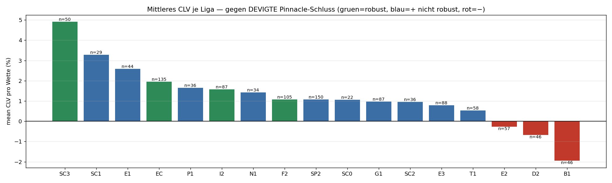
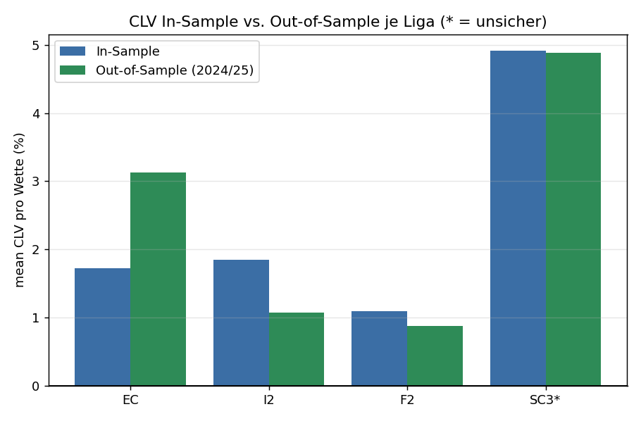
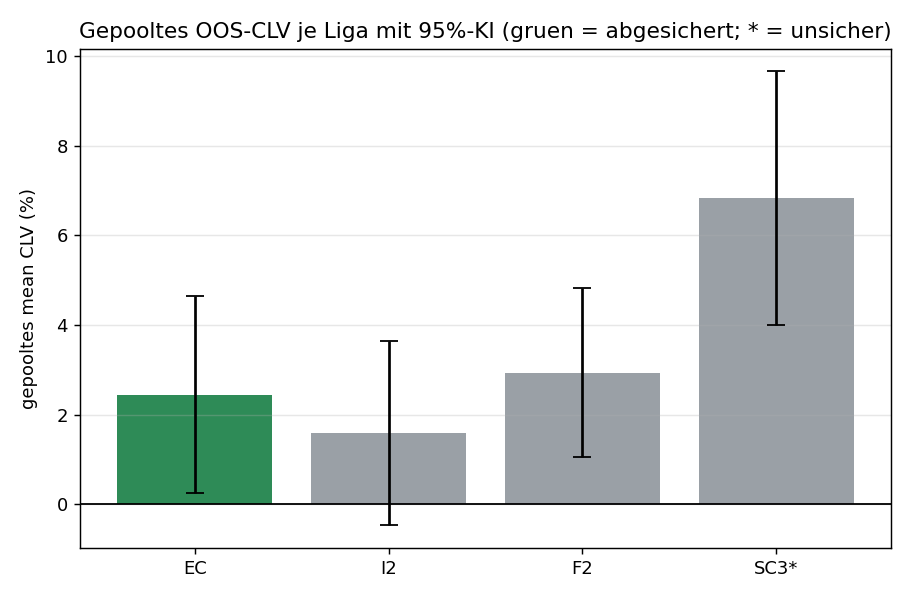
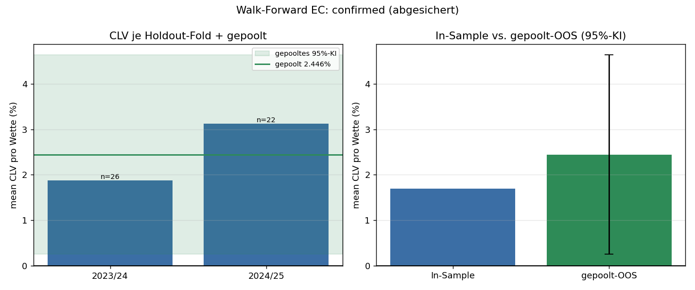
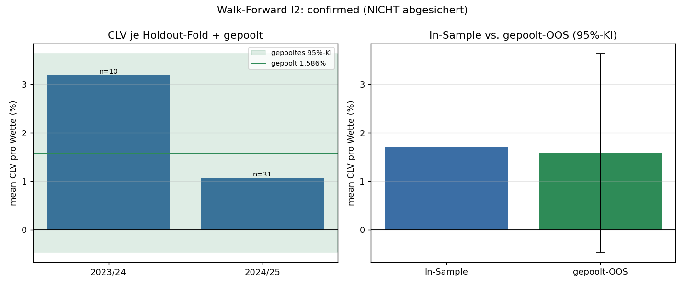

# arbfinder

**A market-efficiency study of football betting odds: can a single, realistically
reachable book systematically beat the sharp closing line — and does the edge
survive out-of-sample?**


> **TL;DR.** This project searches for an exploitable, out-of-sample-stable edge in
> football match-odds markets, using **Closing Line Value (CLV)** against the
> margin-removed Pinnacle closing line as the primary metric. The honest result:
> the efficient EPL shows **nothing** in moderate odds; a scan of 17 less-liquid
> leagues surfaced 4 candidates; a single-season holdout confirmed one (Italian
> Serie B); but a **walk-forward** over multiple seasons **demoted it** and left
> exactly one league (English National League) only *marginally* secured — its 95%
> CI lower bound is +0.25% under an admittedly optimistic independence assumption.
> **The deliverable is the methodology, not a profit claim.** Finding one thin
> candidate and disproving three is presented as the success: scientific
> discipline and protection against overfitting are the point.

---

## Why this exists (and how to read it)

I built this as a portfolio piece for quantitative / quant-dev / data-science
roles. The selling point is **rigour and intellectual honesty**, not a money
machine. Betting markets are a clean lab for market-efficiency questions — events
resolve to known ground truth within days and a near-consensus sharp price exists —
so they let me demonstrate the workflow a quant actually cares about: devigging,
leakage-free validation, multiple-testing control, walk-forward analysis, and
confidence intervals, with every limitation stated out loud.

For the deep dive (maths, devigging, the full validation logic, exact verdict
definitions), see **[docs/METHODOLOGY.md](docs/METHODOLOGY.md)**.

## Contents

- [Motivation & problem](#motivation--problem)
- [Methodology](#methodology)
- [Results](#results)
- [Key engineering decisions](#key-engineering-decisions)
- [Architecture](#architecture)
- [Installation & usage](#installation--usage)
- [Reproducibility](#reproducibility)
- [Honest limitations & what I'd do next](#honest-limitations--what-id-do-next)
- [Tech stack](#tech-stack) · [License](#license) · [About](#about)

## Motivation & problem

A decimal odd `o` implies probability `1/o`. For a complete market the bookmaker's
**overround** is `Σ 1/oᵢ > 1` (the margin). If the *best* cross-book prices ever
sum to `< 1`, a risk-free **Dutch book** (arbitrage) exists. That detection is a
~30-line mathematical fact (`arbitrage.py`) with **no overfitting risk** — and
therefore the *least* interesting part of the project.

The real question is about **predictive** edge: can a price from a single book you
can actually bet (Bet365) systematically beat the **fair** (margin-removed)
*closing* line of the sharpest book (Pinnacle)? The maths there is trivial too —
the edge, if it exists, lives in **data quality and disciplined validation**, which
is exactly what this repo is built to stress-test.

## Methodology

The pipeline (full detail in [docs/METHODOLOGY.md](docs/METHODOLOGY.md)):

**Data & metric**
- **Source:** [football-data.co.uk](https://www.football-data.co.uk) historical CSVs
  (closing odds of many books **plus** match results). Used within its terms — only
  known, fixed file URLs are fetched (`download_data.py`); the site is never scraped
  or parsed.
- **Pinnacle as the sharp anchor.** Pinnacle's devigged line is a far better
  fair-value estimate than an average over soft books. Devig = take `1/o`, renormalise
  to sum 1 (margin removed). Circularity is avoided by leave-one-out exclusion.
- **CLV as the primary metric:** `CLV% = (bet_odd × p_close − 1) × 100`, where
  `p_close = devig(Pinnacle close)`. CLV is the **leading indicator**: it needs no
  match results, is far less noisy than realised PnL, and is the standard evidence
  of skill (consistently beating the closing line). Negative CLV with positive PnL
  ⇒ the PnL was luck. Crucially the benchmark is the **devigged** close — a
  deliberately *harder* bar than the margin-shortened raw price.
- **Moderate odds 2.0–4.0** to avoid the longshot trap (on EPL, 46 of 49 edge-hits
  were longshots at odds > 4.0 — reported, not hidden).

**The validation hierarchy** (the centrepiece)
1. **Three-tier verdict** `confirmed / parked / rejected` — no hard guillotine; only
   `rejected` is terminal, `parked` keeps promising-but-thin candidates alive
   (after López de Prado).
2. **Multiple-testing deflation** of the in-sample edge (mild, log-scaled,
   informative-only).
3. **Bankroll simulation** with a binding €100 stake, flat and ¼-Kelly, and **ruin**
   (kills the infinite-capital illusion).
4. **Stress checks:** price haircut (executability) and concentration by
   season / book / odds bucket (ruin-independent flat-unit ROI).
5. **Single holdout → walk-forward with pooling and 95% confidence intervals.** A
   tiny holdout *must* `park`, never `confirm` (`min_samples ≥ 30`).
6. **`statistically_secured`** only if `confirmed` **and** the pooled CI excludes 0 —
   and even that is flagged *barely secured* when the lower bound sits near zero,
   with the optimistic-independence caveat stated in the output itself.

## Results

The honest journey across four stages (real numbers; machine-readable evidence in
[`docs/results/`](docs/results), regenerate with [`make reproduce`](#reproducibility)):

**Stage 0 — EPL (the efficient market): nothing.**
With Bet365 vs. the devigged Pinnacle close in 2.0–4.0 odds, only **3** moderate-odds
value bets exist across 3 seasons — **46 of 49** edge-hits are longshots (> 4.0) that
the odds filter deliberately removes. As expected for one of the most efficient
markets in the world, there is no robust edge.
([`docs/results/epl_baseline.json`](docs/results/epl_baseline.json))

**Stage 1 — Less-liquid league scan: 4 candidates.**
17 leagues, 85 league-season files, **29,798 matches** (2020/21–2024/25). Four leagues
clear the in-sample robustness bar (mean CLV clearly > 0, share-positive > 55%, spread
across ≥ 2 odds buckets, n ≥ 50): **SC3, EC, I2, F2**.
([`docs/results/league_scan.json`](docs/results/league_scan.json))



**Stage 2 — Single-season holdout (train 2020/21–2023/24 → test 2024/25): I2 confirmed.**
Only **I2 (Serie B)** survives: in-sample +1.84% → OOS **+1.07%** over n=31. **EC** is
the most intriguing *parked* case (OOS +3.13% but n=22 < 30); F2 (n=6) and SC3 (n=5)
are parked on tiny samples. ([`docs/results/oos_summary.json`](docs/results/oos_summary.json))



**Stage 3 — Walk-forward + pooling + 95% CI: I2 demoted, only EC marginally secured.**
Expanding-window folds (holdouts 2023/24 and 2024/25) pool OOS bets per league:

| League | in-sample | pooled OOS | n | folds + | 95% CI | verdict |
|---|---|---|---|---|---|---|
| **EC** National League | +1.70% | **+2.45%** | 48 | 2/2 | **[+0.25, +4.64]** ✓ excl. 0 | `confirmed` · **barely** secured |
| **I2** Serie B | +1.70% | +1.59% | 41 | 2/2 | **[−0.46, +3.64]** ✗ incl. 0 | `confirmed` · **not** secured |
| **F2** Ligue 2 | +0.95% | +2.93% | 14 | 2/2 | [+1.05, +4.82] ✓ | `parked` (n < 30) |
| **SC3** Scottish L2 *(uncertain)* | +3.95% | +6.83% | 25 | 2/2 | [+4.00, +9.66] ✓ | `parked` (n < 30) |

([`docs/results/walkforward_summary.json`](docs/results/walkforward_summary.json))



The walk-forward earns its keep: **I2's single-season "confirmed" did not hold** —
pooling two folds gives a CI that **includes 0**, so its positive mean is not
statistically secured. **EC** is the only league `confirmed` *and* with a pooled CI
above 0 — but only *barely* (lower bound **+0.25%**), under a CI that the code itself
flags as optimistic. And "2/2 folds positive" is mean-only: EC's first fold (2023/24)
was effectively a coin-flip (mean +1.87% but **median −0.31%, 50% positive**); the
signal comes from the second fold and the pooled sample, not from both windows equally.

<p>


</p>

**Honest conclusion.** One league (EC) is *statistically just-positive* on the pooled
sample (positive on the mean in both holdout windows, but one of them barely so) — a
real signal worth more data, yet **thin, optimistically estimated, and unproven against
costs and stake limits**. One candidate (I2) was disproved by the walk-forward; two
remain unproven on sample size. **No profit
is claimed.** Surfacing one marginal candidate and rejecting the rest — with every
caveat visible — is the result.

## Key engineering decisions

- **`src/` layout, fully typed, mypy-clean (28 modules), 272 tests** — runnable
  entirely offline against bundled mock fixtures (no API key, no network).
- **Extensible `Strategy` interface + registry** — arbitrage and value betting are
  interchangeable strategies; a `requires_validation` flag routes *predictive*
  strategies through the three-tier judge while pure arbitrage (a fact) bypasses it.
- **Swappable `FairProbabilityModel`** — consensus-devig vs. single-sharp-anchor are
  drop-in; the fair-value estimate is the real lever, so it is isolated behind an ABC.
- **Defensive data parsing** — encoding fallback (`utf-8 → cp1252 → latin-1` for the
  smart-apostrophe files), the `VC`/`...C` closing-column ambiguity handled correctly,
  missing-field rows skipped *and reported* (`skipped_incomplete`), never silently
  dropped or back-filled with placeholders.
- **No silent truncation** — every filter (odds window, completeness, ruin) is counted
  and surfaced in the JSON, so a reader can see exactly what was excluded and why.
- **Adversarial review at each step** — every feature was reviewed by an independent
  multi-agent pass (find → independently refute by reproduction) before commit;
  several real honesty bugs were caught and fixed (e.g. ruin-truncated season ROI; a
  razor-thin CI once oversold as "clearly above 0"). The git history shows the loop.
- **Guardrails** — detect/report only (no bet is ever placed), licensed data via known
  file URLs only (no scraping), API keys read from env and never logged.

## Architecture

```
src/arbfinder/
├── arbitrage.py        Maths core: Dutch-book / overround (a fact, no validation)
├── models.py           Provider-independent Event/Market; identity = teams AND kickoff
├── normalize.py        3-stage team matching (alias → canonical → fuzzy)
├── fair_probability.py Swappable fair-prob models: consensus-devig, Pinnacle anchor
├── strategies/         Strategy ABC + registry; arbitrage & value strategies
├── providers/          Data sources: offline mock, football-data CSV, The Odds API
├── detector.py         provider → normalize → per-market detection → signals
├── backtest.py         Eval harness; emits a validation.judge() verdict per strategy
├── validation.py       Three-tier judge, multiple-testing deflation, purged splits
├── diagnostics.py      Bankroll/ruin simulation + stress checks (haircut, concentration)
├── pinnacle.py         Pinnacle-anchor + CLV analysis (single-market)
├── leaguescan.py       Multi-league scan: devigged-close CLV, robustness ranking
├── oos.py              Out-of-sample holdout + walk-forward pooling + 95% CI
├── plotting.py         matplotlib charts (optional dependency)
└── cli.py              `arbfinder` CLI (scan, backtest, league-scan, oos-test, diagnose, …)
download_data.py        Targeted download of known football-data CSV URLs (no scraping)
scripts/reproduce.sh    End-to-end regeneration of all results
```

## Installation & usage

```bash
git clone <repo-url> && cd arbfinder
python -m venv .venv && source .venv/bin/activate
pip install -e ".[dev,plot]"     # core is pure-stdlib; matplotlib only for plots

make test      # 272 passing
make lint      # mypy, clean
make demo      # offline demo on bundled mock fixtures (no data, no network)
```

> **A note on language.** This README, the analysis, and all metric names are in
> English. The in-code docstrings and the CLI's one-paragraph summaries are in
> **German** — the project's working language during development. The verbatim
> output below is therefore German (translation in the comment).

**Offline demo** (no data download needed — uses `fixtures/`):

```text
$ arbfinder scan
Provider=mock  Strategie=arbitrage
Events: 5 -> 5 zusammengefuehrt | Maerkte geprueft: 5 | verworfen (unvollstaendig): 1 | verworfen (<2 Ausgaenge): 0 | Signale: 2
  • Manchester City v Arsenal [h2h] kind=arbitrage edge=2.41%
      Quoten: Manchester City @ 2.12 (BookieB), Draw @ 3.75 (BookieB), Arsenal @ 4.2 (BookieA)
      Einsaetze: Manchester City=483.07, Draw=273.1, Arsenal=243.84
  • Tottenham Hotspur v United [h2h] kind=arbitrage edge=2.75%
      Quoten: Tottenham Hotspur @ 2.75 (BookieB), Draw @ 3.55 (BookieB), United @ 3.05 (BookieB)
      Einsaetze: Tottenham Hotspur=373.65, Draw=289.45, United=336.9

Hinweis: Nur Erkennung/Meldung — es werden KEINE Wetten platziert.
# 5 events, 5 merged, 5 markets, 1 dropped as incomplete, 0 with <2 outcomes, 2 signals;
# stakes are on a notional 1000-unit bankroll; "detection/reporting only — no bets are ever placed."
```

**Research commands** (need real data — see [Reproducibility](#reproducibility)):

```bash
# Rank less-liquid leagues by devigged-close CLV (B365, odds 2.0–4.0)
arbfinder league-scan --csv-dir data/leagues --plots results

# Single-season out-of-sample holdout, judged by validation.judge
arbfinder oos-test --csv-dir data/leagues --plots results

# Walk-forward over rolling holdouts: pooling + 95% confidence intervals
arbfinder oos-test --walk-forward --csv-dir data/leagues --plots results

# Honest bankroll/ruin + stress diagnosis of any settled value run
arbfinder diagnose --data <settled.jsonl> --plot results/bankroll.png
```

Each command writes a self-contained JSON report and prints a sober one-paragraph
summary (verdict, the thin-signal caveats, costs/limits not modelled).

**Data acquisition.** `python download_data.py` fetches the league CSVs from their
**known, fixed** football-data.co.uk URLs (`mmz4281/<season>/<league>.csv`) into
`data/leagues/` — skip-if-exists, polite delay, realistic User-Agent, and
self-correction (404 / no-Pinnacle / wrong-encoding files are skipped and reported).
No HTML pages are requested or parsed. Raw CSVs are **not** committed (size / ToS);
they are fully reproducible from the script.

## Reproducibility

```bash
make reproduce        # or: bash scripts/reproduce.sh
```

This runs the full chain — download → EPL baseline → league scan → single holdout →
walk-forward — writing all JSON and plots to `results/` (gitignored scratch). The
curated subset the README embeds is committed under [`docs/`](docs). A fresh clone can
reproduce every headline number; the offline `make demo` reproduces the detection
pipeline with **no** data or network at all.

## Honest limitations & what I'd do next

Stated prominently, because for a quant these *are* the interesting part:

- **The CI is optimistic.** It treats every bet as independent; real bets are
  correlated (same match / match-day / market-wide moves), so the true interval is
  wider — EC's +0.25% lower bound could cross zero. **Next:** a **block/cluster
  bootstrap** (resample by match-day) for a correlation-aware interval. *This is the
  single most important next step.*
- **Costs and stake limits are unmodelled.** No commission/tax, and crucially no
  bookmaker limits — and the books offering the most generous prices limit winners
  first. **Next:** a cost/limit haircut sensitivity on the pooled CLV.
- **Thin samples & one test window.** A few hundred bets across five seasons; even a
  clean walk-forward is a *signal*, not a guarantee. **Next:** more leagues of the
  same tier to grow EC/F2-like samples.
- **Different domain.** **Next:** apply the same validated pipeline to **prediction
  markets** (e.g. exchange/Polymarket-style venues) where there is **no bookmaker
  stake limit** — the binding real-world constraint here — making any surviving edge
  actually executable.

## Tech stack

Python 3.11+ (**pure-standard-library core** — no heavyweight deps for the maths or
validation), `matplotlib` for optional plots, `pytest` for tests, `mypy` for static
typing. Optional extras: `requests` (live Odds-API provider), `rapidfuzz` (fuzzy team
matching), `apscheduler` (periodic scanner). Deliberately dependency-light so the
methodology — not a framework — is the substance.

## License

[MIT](LICENSE).

Data is from football-data.co.uk and used in line with its terms (known file URLs
only, no scraping); raw data is not redistributed in this repo.

## About

Built by **Leonardo Berisha** as a demonstration of quantitative research
methodology — devigging, leakage-free validation, walk-forward analysis, and honest
statistical reporting. Feedback and questions welcome.

- GitHub: `<your-handle>`  ·  LinkedIn: `<your-profile>`  ·  Email: `<your-email>`
